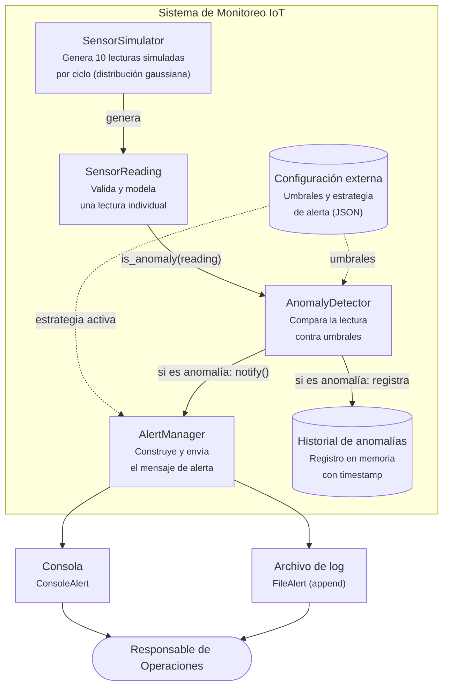

# Diagrama C4 - Nivel 2 (Contenedores)
## Sistema de Monitoreo IoT - Bodega Industrial

Este diagrama muestra los contenedores (componentes desplegables/ejecutables) que forman el sistema y cómo fluye la información entre ellos: desde la simulación/lectura de sensores hasta la notificación de una alerta.

## Descripción del flujo

1. **SensorSimulator** genera un ciclo de 10 lecturas (`SensorReading`) simulando los 10 sensores físicos de la bodega, usando una distribución gaussiana configurable (no hardcodeada).
2. Cada `SensorReading` se valida al crearse (tipo de sensor válido, valor numérico).
3. **AnomalyDetector** recibe cada lectura y la compara contra los umbrales cargados desde la **Configuración externa** (JSON), nunca contra valores fijos en el código.
4. Si la lectura es anómala:
   - Se registra en el **Historial de anomalías** (trazabilidad).
   - Se delega a **AlertManager**, que usa la estrategia de alerta activa (también cargada desde configuración) para notificar.
5. **AlertManager** envía el mensaje por el canal correspondiente: **Consola** (`ConsoleAlert`) o **Archivo de log** (`FileAlert`), de forma intercambiable sin modificar su propio código (principio Open/Closed).
6. El **Responsable de Operaciones** consume la alerta desde el canal configurado.

> Nota: este es un diagrama de nivel 2 (Contenedores) del modelo C4 — muestra las piezas ejecutables/desplegables del sistema y sus relaciones, sin entrar al detalle de clases internas (eso correspondería a un diagrama de nivel 3, Componentes, fuera del alcance de esta entrega).